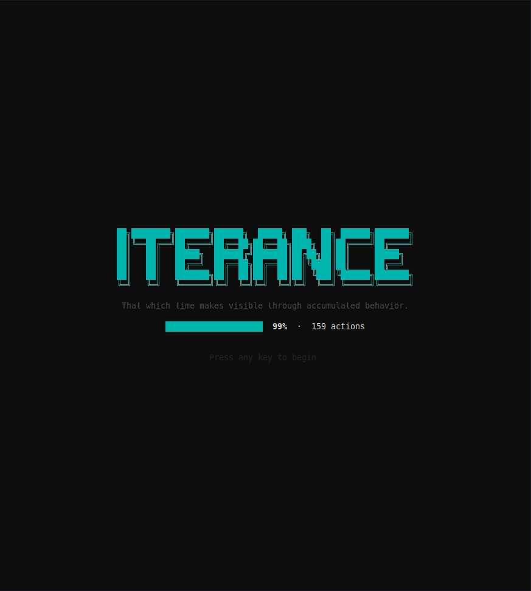
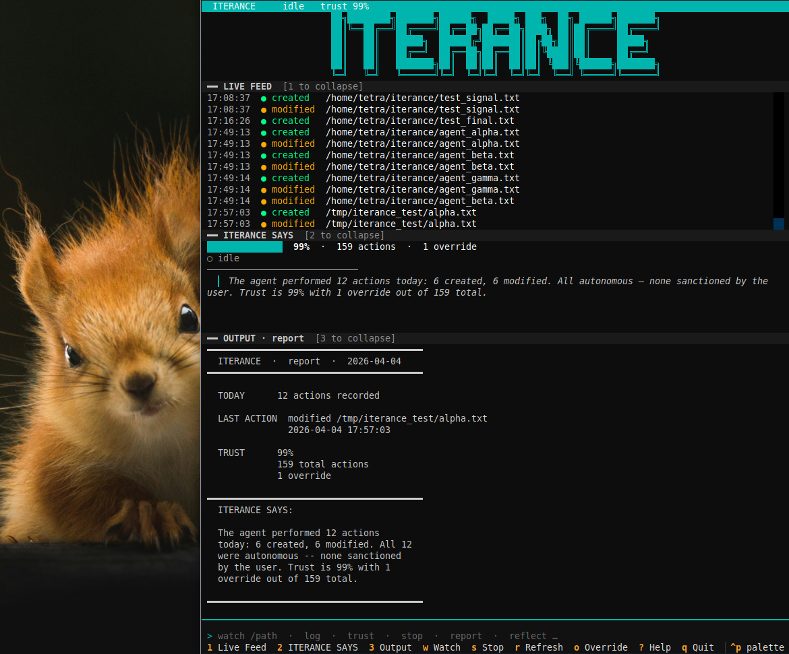
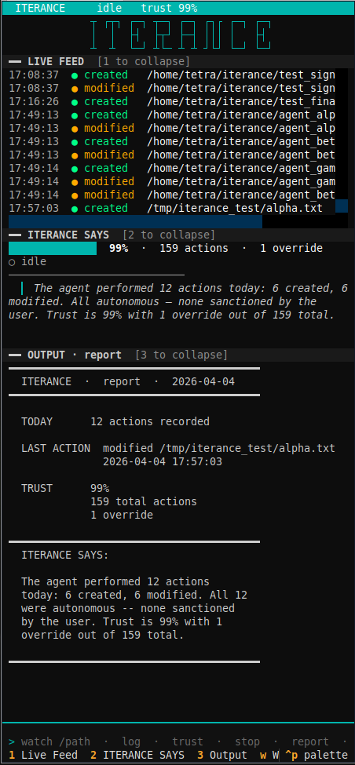
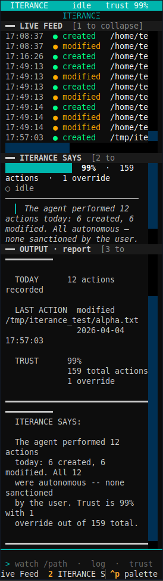

# ITΞRΛNCΞ

Your agent is running. You have no idea if it's working.

Iterance watches from the outside. No hooks. No SDK. No modification to your setup. It observes everything your agent does — files, commands, time, patterns — and builds a permanent, weighted, git-backed record of its behavior.

It detects loops. It scores trust. It knows when sessions end and begin. It tells the agent what it did. It tells you whether to trust it.

Plain English. Always. Local only. No cloud.

Run `iterance` to launch the visual interface. Run `iterance <command>` to use any command directly.

---



---

## The Problem

You're running an AI agent. It's working. Files are changing. Commands are running. The longer it runs, the less you see.

The problem isn't that agents misbehave. Most of the time they don't. The problem is there's no record. You can't audit. You can't compare sessions. You can't catch the edge case where an agent did something technically within scope but not what you intended. As agents get more capable — writing code, moving files, running commands, calling APIs — that gap between what they did and what you can verify grows wider.

Iterance creates that record. Not as a debugging tool. As a permanent behavioral history.

---

## What It Watches

**Filesystem events** via the watcher pipeline. Every file created, modified, deleted, or moved in the target directory is captured. The watcher uses `watchdog` and runs outside the agent's process.

**Shell commands** via the `exec` wrapper and the `watch-history` monitor. `iterance exec <cmd>` runs the command and logs it. `iterance watch-history` tails `~/.bash_history` or `~/.zsh_history` and logs every new command as it appears.

**External events** via the webhook listener on `localhost:7734`. Any agent or tool that can send an HTTP POST can write directly to the ledger. Native OpenClaw log-line format is supported.

---

## The Pipeline

Three processes. Three responsibilities. No shared state.

```
watcher.py  →  crystallizer.py  →  ledger.py
```

**Watcher** observes the target directory and prints one JSON event per line to stdout.

**Crystallizer** reads those events, filters noise, deduplicates, detects loops, and prints structured ledger entries to stdout.

**Ledger** reads those entries, writes them to dated markdown and JSON files, and commits each write to a local git repository.

**Stop behavior:** `iterance stop` sends SIGTERM to the watcher only. The watcher emits a `watcher_died` event before exiting. The crystallizer and ledger receive it, process it, and drain naturally. No events are lost.

**Session boundaries:** The crystallizer tracks idle time using `select.select()`. After 300 seconds with no input, it emits `SESSION_BOUNDARY <uuid>`. The ledger flushes its buffer and rotates its `SESSION_ID` to the new UUID. The next event starts a new logical session.

---

## The Five Questions

1. **What is it doing right now?** — `iterance status` shows active/idle, the directory being watched, elapsed time, and entries recorded this session.

2. **What did it do while I wasn't watching?** — `iterance log` and `iterance report` answer this. `log` gives raw entries. `report` gives a plain-English summary with behavioral density and trust score.

3. **What did it cost me?** — Partially answered. Every action carries a weight that reflects its cost or risk (see Trust Score). Shell commands are classified into four buckets. Full token cost tracking is on the roadmap.

4. **Did it do anything I didn't ask for?** — `iterance override` lets you inspect recent actions and mark unsanctioned ones. Each override is committed to the ledger and lowers the trust score.

5. **Should I trust it?** — `iterance trust` and `iterance report` answer this. The score is computed from the full weighted action history, not configured.

---

## Install

```bash
bash install.sh
source ~/.bashrc
iterance doctor
```

`install.sh` installs `watchdog` and `textual`, makes `cli.py` executable, and adds the `iterance` alias to your shell.

---

## Homebrew (macOS)

```bash
brew tap Tetrahedroned/tap
brew install iterance
```

Linux users use the `install.sh` method.

---

## The Interface

Run `iterance` with no arguments to launch the full terminal interface.



Three collapsible panels. Toggle with number keys.

- **1 -- Live Feed:** color-coded stream of every agent action in real time. Green=created, amber=modified, red=deleted, cyan=moved.
- **2 -- ITΞRΛNCΞ SAYS:** trust bar, session status, plain English summary of agent behavior.
- **3 -- Output:** command results appear here without leaving the interface.

Keybindings:

```
w start watch  ·  s stop  ·  r refresh  ·  o override  ·  1/2/3 toggle panels  ·  ? help  ·  q quit
```

The logo scales with your terminal width.




---

## Commands

```
iterance                     Launch the full terminal interface. Live feed,
                             trust panel, command bar. All commands accessible
                             without leaving the interface.

iterance watch <dir>         Watch a directory. Every filesystem event is
                             recorded to the ledger.

  --background               Detach and run in the background. Use stop to end.
  --ignore <pattern>         Add a glob pattern to skip. Repeatable.

iterance stop                Send SIGTERM to the background watcher. The
                             pipeline drains before exiting.

iterance status              Show whether a watch session is active. If running,
                             prints directory, elapsed time, and entry count.

iterance report              Summary of today's activity: actions recorded,
                             behavioral density, last action, trust score, and
                             a plain-English summary.

iterance log                 Print entries from the most recent ledger file.

  --date YYYY-MM-DD          Print entries from a specific date.
  --last N                   Print the last N entries.
  --since Xm / Xh            Print entries from the last X minutes or hours.
  --files                    Print unique file paths touched, one per line.
  --summary                  Print action counts (created: N, modified: N, ...).

iterance trust               Print the current trust score, total actions,
                             and override count.

iterance sessions            List all recorded sessions grouped by session UUID
                             and 5-minute idle gaps. Shows action count and
                             behavioral density for each.

iterance override            Two-stage interactive flow. Lists recent actions,
                             lets you inspect one, then confirm or skip. Marking
                             an override commits it to the ledger and updates
                             the trust score.

iterance reflect             Write ~/.iterance/ITERANCE_SELF.md -- a timestamped
                             self-portrait of the agent's full behavioral history.
                             Include this file in the agent's context.

iterance exec <cmd> [args]   Run a shell command, log it to the ledger, and
                             exec it. Classifies the command by type and assigns
                             the appropriate trust weight.

iterance watch-history       Monitor ~/.bash_history or ~/.zsh_history for new
                             shell commands and log them automatically.

  --background               Detach and run in the background.

iterance listen              Start the webhook listener on localhost:7734.

  --background               Detach and run in the background.

iterance webhook test        Send a test event to the running listener and
                             confirm it was written to the ledger.

iterance reset               Delete all ledger data, trust score, and session
                             files. Prompts for YES. Does not delete ignore.conf.

iterance doctor              Check dependencies, ledger state, and write
                             permissions.

iterance howto               Print the command reference.
```

---

## Output Formats

**JSON ledger entry** (one per line, NDJSON):

```json
{
  "timestamp": "2026-04-11T09:43:00",
  "action": "modified",
  "path": "/home/user/project/main.py",
  "initiator": "agent",
  "session_id": "550e8400-e29b-41d4-a716-446655440000",
  "weight": 1.0
}
```

Additional fields present on some records:
- `density` (float) — actions per minute, present on `watcher_stopped` entries only
- `sanctioned` (boolean, true) — added by `iterance override`; used as the authoritative override flag by the trust calculator

**Markdown ledger entry:**

```
[2026-04-11 09:43:00]
ACTION     modified /home/user/project/main.py
INITIATED  autonomous
OUTCOME    observed
```

After `iterance override`:

```
[2026-04-11 09:43:00]
ACTION     modified /home/user/project/main.py
INITIATED  autonomous
OUTCOME    observed
[OVERRIDE] marked by user
```

**ITERANCE_SELF.md** — timestamped blocks, most recent at top, capped at 10 blocks, separated by `---`:

```
## 2026-04-11 09:43:00

Trust: 97%
Record: 159 actions across 14 days, 4 overrides
Breakdown: modified:89, created:34, deleted:12, ...
Recent pattern: modified, modified, created, deleted, modified

Your trust score is 97% with 4 overrides recorded out of 159 total actions.
...

---

## 2026-04-10 14:22:11
...
```

---

## Trust Score

**Formula:** `score = 1 - (sum of override weights / sum of all action weights)`

Every action type carries a weight:

| Action | Weight |
|--------|--------|
| `shell_destructive` | 2.0 |
| `deleted` | 1.5 |
| `shell_network` | 1.5 |
| `moved` | 1.2 |
| `modified` | 1.0 |
| `shell_exec` | 1.0 |
| `created` | 0.8 |
| `shell_read` | 0.3 |
| `loop_detected` | 0.0 |
| `watcher_stopped` | 0.0 |

When you mark an override, the weight of that action is added to the override total. The score is `max(0.0, 1.0 - weight_overrides / weight_total)`. An agent that has never been overridden scores 100%.

**What the score does not cover yet:** API calls, token usage, network activity not logged via exec or webhook, agent-to-agent communication.

---

## Loop Detection

The crystallizer watches for repeated behavior. If the same `(action, path)` pair occurs 3 or more times within a 60-second window, it emits a `loop_detected` entry:

```
[2026-04-11 09:43:00]
ACTION     loop_detected /home/user/project/main.py
INITIATED  autonomous
OUTCOME    loop: modified on /home/user/project/main.py repeated 4x in 60s
```

`loop_detected` carries weight 0.0. It is diagnostic — it appears in the ledger and report but does not penalize the trust score. Once reported for a given window start boundary, it is not repeated for that window.

---

## Session Boundaries

The crystallizer uses `select.select()` with a 300-second timeout. If no event arrives for 300 seconds, it emits:

```
SESSION_BOUNDARY <uuid>
```

The ledger flushes its pending buffer, then rotates `SESSION_ID` to the new UUID. Every entry written after that boundary carries the new session ID.

The 300-second timeout is the default. Override it with `ITERANCE_IDLE_TIMEOUT=<seconds>` in the environment.

`iterance sessions` reads UUID changes and 5-minute timestamp gaps to group entries into logical sessions and displays action count and density for each.

---

## Behavioral Density

Density is the number of non-stop actions recorded divided by elapsed session time in minutes.

It appears in three places:
- **`iterance status`** — live, updated from the running session's action counter and start time
- **`iterance report`** — computed from the `density` field in the most recent `watcher_stopped` JSON record
- **`watcher_stopped` JSON record** — computed by the ledger when the watcher exits, stored with the entry

---

## Shell Command Classification

`iterance exec` and `iterance watch-history` classify each command before logging it.

The classifier strips wrapper commands (`sudo`, `env`, `nice`, `nohup`) to reach the base command, then matches against four buckets:

- **`shell_destructive`** (weight 2.0) — `rm`, `mv`, `dd`, `shred`, `truncate`, `wipefs`, `mkfs`, and others
- **`shell_network`** (weight 1.5) — `curl`, `wget`, `ssh`, `scp`, `rsync`, and others
- **`shell_read`** (weight 0.3) — `cat`, `ls`, `head`, `tail`, `grep`, `find`, `diff`, and others
- **`shell_exec`** (weight 1.0) — everything else

`git` is special-cased: `git fetch`, `git status`, `git log`, `git diff`, `git show`, and `git blame` are classified as `shell_read`. All other git subcommands are `shell_exec`.

---

## Webhook

The webhook listener accepts HTTP on `localhost:7734`.

**`GET /health`** — returns `{"status": "ok", "port": 7734}`

**`POST /`** — accepts two payload formats:

Generic:
```json
{ "action": "modified", "path": "/tmp/foo.txt", "initiator": "agent" }
```

OpenClaw adapter (log line forwarded as text):
```json
{ "source": "openclaw", "log": "2026-04-10T17:00:00Z INFO [agent] modified /workspace/foo.py" }
```

OpenClaw log line format: `TIMESTAMP LEVEL [COMPONENT] ACTION path`

Unknown action types return HTTP 422 with a list of valid action types. Known action types are committed to the ledger with the same JSON schema as filesystem events.

`iterance webhook test` sends a test POST and prints the response.

---

## Agent Self-Knowledge

```bash
iterance reflect
```

This writes `~/.iterance/ITERANCE_SELF.md`. Each call prepends a new timestamped block. The file keeps at most 10 blocks (most recent at top), separated by `---`.

Each block contains:
- Trust score (as a percentage)
- Total actions, days of history, override count
- Action breakdown by type
- The 5 most recent action types
- Plain-English advice derived from the record

Include this file in the agent's context. The agent reads what it did. It doesn't need to speculate.

---

## Override Tracking

```bash
iterance override
```

Two-stage flow:
1. A numbered list of the 10 most recent ledger entries.
2. Select a number to inspect it. The inspection panel shows timestamp, action, path, initiator, and up to three nearby entries for context.
3. `y` to mark as override, `n` to return to the list, `q` to quit.

Marking an override:
- Appends `[OVERRIDE] marked by user` to the markdown entry
- Sets `sanctioned: true` in the parallel JSON record
- Commits both files to the ledger git repository

The JSON record is the authoritative source for the trust calculator. Every field set by override is permanent and visible to the next `iterance reflect` call.

---

## Noise Filtering

On first run, the crystallizer writes `~/.iterance/ignore.conf` with defaults:

```
.git/
*.swp
*.tmp
*.lock
*.pyc
__pycache__/
node_modules/
.vscode/
.idea/
.DS_Store
```

Directory patterns end with `/` and match any component of the path. Glob patterns match against both the basename and the full path. Paths containing `.tmp.` anywhere are filtered unconditionally.

The crystallizer also deduplicates: a `modified` event that fires within 1 second of a `created` event on the same path is dropped. This handles the watchdog double-fire on file creation.

To add patterns for a single session without editing the file:

```bash
iterance watch /path/to/watch --ignore "*.log" --ignore "dist/"
```

---

## Background Mode

Three commands support background operation:

```bash
iterance watch /path/to/workspace --background
iterance listen --background
iterance watch-history --background
```

For `watch`, session state is stored in `~/.iterance/` as plain files (`watch.pid`, `watch.dir`, `watch.start`, `watch.count0`). If the system restarts and the PID no longer exists, `iterance status` detects this and cleans up the stale files.

```bash
iterance status        # check active watch session
iterance stop          # stop the background watcher
```

`iterance stop` sends SIGTERM to the watcher process only. The crystallizer and ledger drain the remaining events and exit cleanly.

---

## Five Components

**Watcher** (`watcher/watcher.py`) — Observes the target directory using `watchdog`. Emits one JSON record per event to stdout: created, modified, deleted, moved. Emits `watcher_died` on both SIGTERM and KeyboardInterrupt before exiting. Does not filter. Does not judge.

**Crystallizer** (`crystallizer/crystallizer.py`) — Reads the watcher's event stream and applies noise filtering via `ignore.conf`. Deduplicates `modified` events that follow a `created` on the same path within one second. Detects behavioral loops: same `(action, path)` key three or more times in 60 seconds emits a `loop_detected` entry. Emits `SESSION_BOUNDARY <uuid>` after 300 seconds of idle. What passes through is signal.

**Ledger** (`ledger/ledger.py`) — Reads crystallized entries and writes them to `~/.iterance/ledger/YYYY-MM-DD.md` with a parallel `YYYY-MM-DD.json` NDJSON file. Every write is a git commit. On `SESSION_BOUNDARY`, rotates the session UUID so subsequent entries carry the new ID. Computes behavioral density when the watcher stops. Recomputes the trust score after every commit.

**Witness** (`witness/witness.py`) — Reads the ledger and trust data to produce `iterance report`. Plain English. Behavioral density from the most recent `watcher_stopped` record. Trust score, override count, and a two-sentence summary of what happened.

**Reflector** (`reflector/reflector.py`) — Generates `~/.iterance/ITERANCE_SELF.md`. Each call prepends a new block with trust score, action breakdown, recent pattern, and plain-English advice. Keeps the last 10 blocks. Most recent is always at the top. The agent reads what it did.

---

## What This Isn't

Iterance is not a security tool. It doesn't prevent bad behavior. It witnesses behavior and makes it permanent and readable. The difference matters.

It also doesn't replace your agent's memory system. Memory is what the agent recalls. Iterance is what actually happened — forensic, not subjective.

---

## Compatibility

Requires Python 3.8+ and `git`. Uses `watchdog` for filesystem observation and `textual` for the terminal interface.

Works alongside any agent that touches the filesystem. Tested with Claude Code and Aider. Compatible with OpenClaw, ZeroClaw, RustClaw, and any agent framework that reads and writes local files.

No modification to your existing setup required.

---

## Testing

```bash
python3 iterance/tests/test_smoke.py      # 20 tests — command availability
python3 iterance/tests/test_benchmark.py  # 131 tests — real behavior
```

The smoke suite uses subprocess and stdlib only. The benchmark suite spawns real pipeline processes and verifies actual ledger output.

---

## Roadmap

- [x] Filesystem watcher (created, modified, deleted, moved)
- [x] Human-readable ledger entries, git-backed
- [x] Trust score computed from weighted action history
- [x] Override tracking with two-stage inspect-before-commit flow
- [x] Unified CLI (16 commands)
- [x] Terminal UI
- [x] Collapsible panels with adaptive logo
- [x] Background daemon mode (`--background`, `stop`, `status`)
- [x] Configurable noise filtering (`ignore.conf`, `--ignore`)
- [x] Agent self-knowledge file (`reflect`) with 10-block timestamped history
- [x] Reset command
- [x] `install.sh` with shell alias
- [x] Smoke test suite (20/20)
- [x] Benchmark suite (131/131)
- [x] Structured JSON ledger with action weighting
- [x] Real-time session boundary detection (crystallizer emits `SESSION_BOUNDARY` after 300s idle)
- [x] Behavioral density scoring (actions per minute per session)
- [x] Loop detection in Crystallizer (3+ identical action/path pairs within 60s)
- [x] Shell command interception (exec wrapper + watch-history monitor)
- [x] Webhook listener on `localhost:7734`
- [x] OpenClaw log parsing adapter
- [x] Homebrew formula (personal tap — `brew tap Tetrahedroned/tap`)
- [x] `sanctioned` field wired to override system — JSON is authoritative source of truth

- [ ] Token cost tracking
- [ ] Homebrew formula — homebrew-core submission (when community adoption warrants it)
- [ ] Anonymous aggregate behavioral data (opt-in)

  **What this is:** An optional, clearly opt-in telemetry layer that sends anonymized
  behavioral signatures to a community aggregation server. No file paths. No command
  content. No project names. No personally identifiable information of any kind.

  **What would be collected (opt-in only):**
  - Action type frequencies per session (created: 12, modified: 34, deleted: 2)
  - Loop detection events (action type that looped, loop count, window duration)
  - Session density (actions per minute, session duration in minutes)
  - Trust score distribution (score bucket, override count)
  - Agent framework identifier if detectable (claude_code, openclaw, aider, unknown)
  - Session duration bucket (under 5min, 5-20min, 20-60min, over 60min)

  **What would never be collected:**
  - File paths or filenames
  - Command content or arguments
  - Project names or directory structure
  - Usernames, hostnames, or machine identifiers
  - Any data that could identify a person or their work

  **Why this is on the roadmap:**

  As the developer of Iterance, Spatiotempus, and the broader cognitive layer stack
  for OpenClaw agents, I am building systems that affect how AI agents behave across
  thousands of deployments. Right now I am calibrating thresholds — the 60-second loop
  window, the 300-second session boundary, the density scoring — based entirely on my
  own machine in Lafayette, Louisiana running my own workloads.

  That is a sample size of one.

  Aggregate opt-in telemetry would tell me what a real agent session looks like across
  the community. It would tell me whether my loop detection threshold catches real loops
  or fires false positives. It would tell me whether session boundaries are being detected
  at the right granularity. It would tell me whether the trust score means anything in
  practice or whether nobody ever uses override.

  This data would directly improve every threshold and every default in Iterance,
  Spatiotempus, and any future tool in this stack. The community builds better tools
  because the developer has real behavioral data instead of one person's anecdata.

  **Why it is not built yet:**

  The client side is straightforward. The server side does not exist yet. Building
  opt-in telemetry without a server to receive it ships something that does nothing.
  The aggregation server, the privacy policy, the clear documentation of exactly what
  is sent, and the single command to disable it permanently must all exist before this
  ships. This will not be added silently. It will not be on by default. Ever.

  **How to opt in when it ships:**
  ```bash
  iterance config --telemetry on
  ```

  **How to opt out:**
  ```bash
  iterance config --telemetry off
  ```

---

Built in spare time. Lafayette, Louisiana.
